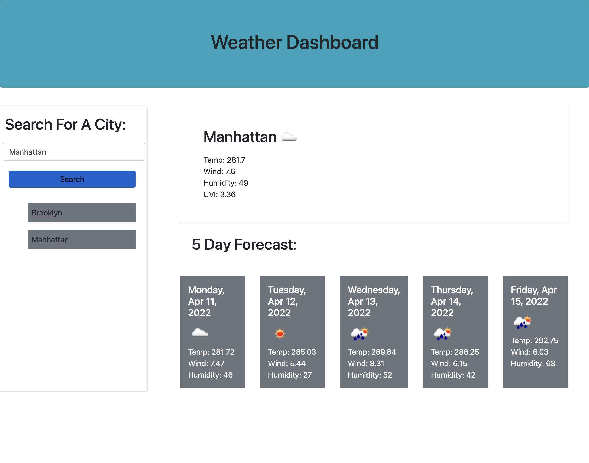

# Weather
Weather Reporting and forecasting

This weather reporting interface fetches api responses for the requested cities and pulls up the current weather as well as the 5 day forecast for the next 5 days. 

Search history will be saved in local storage and will display on the screen as a search history. You can then click on those histories and click them to research for the weather for that specific city.

Deployed Application is live [here](https://splitrabbit.github.io/Weather/) .

Screenshot: 